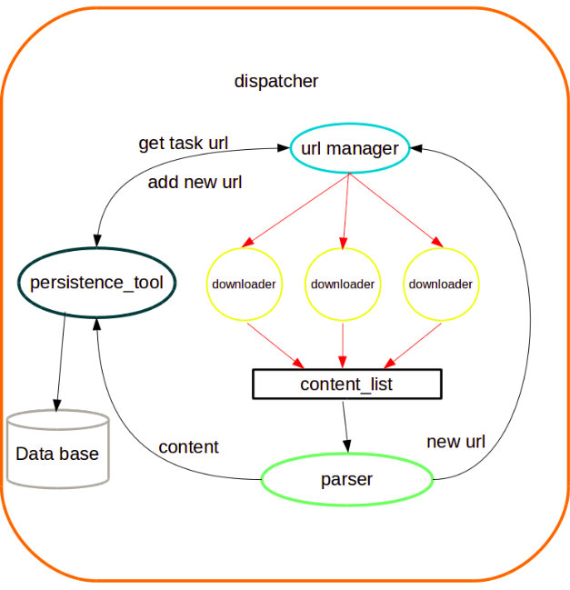
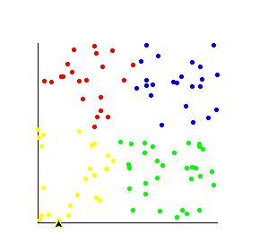

# GraduationDesign
#### 课题
关于网页内容的聚类算法实现

**进度- week1(03/19-03/26)**

-  重构数据采集模块,之前的爬虫速度较慢,不能很好的完成工作,重构后大体结构如下:  

- 实验k-means聚类算法,将一百个二维平面上的点聚为4类,实验结果如下:  

    说明:这个星期的进度比较慢,重构了一下数据采集模块,还有部分编码工作没完成.   
    下个星期的目标是继续完成上星期未完成的编码工作,在做两个聚类算法的实验,以及引入分词,争取能在这个星期结束时完成所有的数据准备工作.

**进度- week2(03/27-04/02)** 

-  无进度,未更新其他东西,看了下层次聚类的两个算法,未实践

**进度- week3(04/03 - 04/09)**

- 本周准备对数据进行清洗,正式引入分词包提取高频词,准备采用开源分词包 --- [结巴分词](https://github.com/fxsjy/jieba)进行处理.
- 已完成高频词的提取工作,下一步是考虑如何进行聚类实现了

> 结巴分词相关资料
HMM(隐马尔可夫模型)及viterbi算法:
[HMM及viterbi](http://www.cnblogs.com/skyme/p/4651331.html)

     **Question:**
     上周在考虑后续聚类实现时想到一个问题,我们采集的数据可能分为n个类别,如果我们采用求距离的方式进行聚类,那我们每个数据需要认为是一个n维的数据吗?即使他在某些维度上的值为0

**暂定目标**

- 编写爬虫收集网页数据
- 完成几个简单的聚类算法实现
    - k-means (HCM)
    - FCM (Fuzz Cluster)
    - 层次聚类
- 引入分词模块,完成采集的内容中高频词汇的提取工作
 
     
